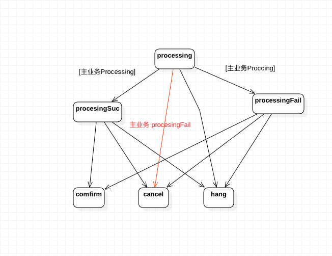

## tcc-design 柔性事务参考实现


- Author: Yuetao Meng
- Mail: mfty1980@sina.com
- Date: 2018-1-2

- update: 2018-5-23  YuetaoMeng  **add demo example**


 ## 特性

 - 演示了一个可用的分布式事务系统 （柔性事务），同时提供简单的 demo 供参考！
 - 演示了如何使用 [finatra](https://twitter.github.io/finatra/)高性能异步RPC，实现了一个轻量级的微服务系统
 - 演示了如何使用 [slick](http://slick.lightbend.com)Functional Relational Mapping (FRM)函数式映射实现轻量级高性能异步统一的数据库访问
 - 业务活动管理器
 - 业务活动恢复器
 - 客户端拦截器
 - 服务端拦截器
 - 支持java api


## 柔性事务相关资料：

  - [大规模SOA系统中的分布事务处理](docs/大规模SOA系统中的分布事务处理.pdf)
  - [支付宝架构与技术](docs/支付宝架构与技术.pdf)
  - [Atomic Distributed Transactions: a RESTful Design](docs/wsrest2014_submission_7.pdf)


 系统架构如下（引用大规模SOA系统中的分布事务处理 p22,p29）：

业务流程图：


逻辑功能图：


## 实现原理


主业务状态转换如下：

- 当所有的从业务都成功时，同时主业务也成功，执行确认（comfirm）操作
- 按照策略，当无法comfirm或cancel到一定次数或时常时，挂起（hang）事务等待人工干预


从业务状态转换如下：
- 从业务和主业务状态基本一致，不再详细描述
- 有一种情况，从业务超时不返回，或则返回结果没有成功记录，此时主业务procssingFail（红色部分）
那么，从业务当前状态实际未知，将在procesing直接调用cancel，这也是为什么只有在主业务processing
时才能写入procesingSuc，或proccssingFail，因为此时主业务确认还是取消已经计算完毕，所以迟到的结果不允许写入，否则会影响一致性。




## 代码结构

代码结构对应关系：

- 业务活动管理器：src/scala/tcc/TccServer.scala
- 业务恢复管理器：src/scala/tcc/TranServer.scala
- 服务端拦截器：  src/scala/tcc/filters/TccSubMainServerFilter.scala
- 客户端拦截器：  src/scala/tcc/filters/TccMainFilter.scala TccSubMainFilter.scala

Demo ：
- 主业务服务：  demo/ordermain
- 从业务服务（订单）：  demo/order
- 从业务服务 （库存）： demo/warehouse

mysql 数据库：
- 业务活动管理器,业务活恢复管理器 : tcc_lv1 ,tcc_lv2
- 从业务服务（订单）：order，order_tr
- 从业务服务（库存）：warehouse，warehouse_tr

[数据库脚本](docs/mysql.sql)

## 编译

```
cd .
sbt
compile
test

```


## 运行与验证

安装数据库并创建数据库表 [数据库脚本](docs/mysql.sql)
修改数据库连接中配置 src/main/resources/application.conf


```
cd .
sbt
project coServer

runMain com.jtb.tcc.TranServerMain
runMain com.jtb.demo.order.OrderServerMain
runMain com.jtb.demo.warehouse.WareHouseServerMain
runMain com.jtb.demo.ordermain.OrderMainServerMain


runMain com.jtb.demo.ordermain.client.OrderClienttMain

runMain com.jtb.demo.recovery.RecoveryServerMain
runMain com.jtb.tcc.TccServerMain


```


名称        | 说明
------     | ---------
TranServerMain  |   启动 业务活动管理器
OrderServerMain  |   启动 从业务服务（订单）
WareHouseServerMain |   启动 从业务服务（库存）
OrderMainServerMain |   启动 主业务服务（订单与库存）
OrderClienttMain    |   启动 主业务服务客户端（调用主业务服务）
RecoveryServerMain    |   启动 业务活恢复管理器适配器（从服务与恢复服务对接服务）
TccServerMain       |     启动 业务活恢复管理器


1 启动 OrderClienttMain 后，模拟生成入库单，订单号 order001，客户号 franchier001，
产品编号 product001, 产品数量 1000 ，此时资源保留，但并不确认，所以

 1. warehouse 为空
 2. orde表有一条订单记录如下，状态为processSuc
```
 'order001','franchiser001','product001','1000','processSuc','196342338245758976'
```

2 启动 TccServerMain， 资源被确认

1. warehouse 有一条库存记录

```
'franchiser001','product001','1000','196342338245758976'
```

2. orde表有一条订单记录如下，状态为comfirm
```
'order001','franchiser001','product001','1000','comfirm','196342338245758976'
```
