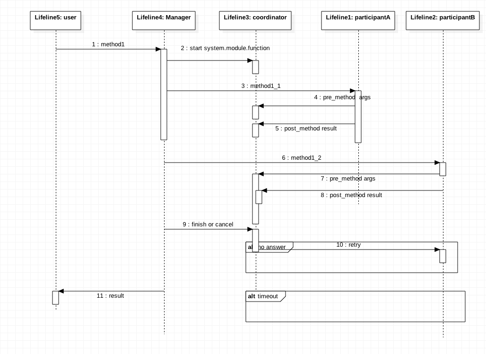

## tcc-design

- Author: Yuetao Meng
- Mail: mfty1980@sina.com
- Date: 2018-1-2

## 关于幂等方法的定义

1. 同一方法，调用多次，返回相同结果，不产生副作用。（规格时间内，如60分）
2. 重复调用方法，应该由框架执行，且不能超过指定时间，如60分,可能还应该包括第一次调用的时间， 上下文。
3. 方法必须在接受时间内结束，修复，如15天内，必须成功或失败。
4. 提供查询方法?

 

* 1 调用方法 method1
* 2 启动coordiniaotr with Id
    * Id 存在，并且有结果，直接返回结果。
    * Id 存在，并且没有结果，等待结果，并发执行中。
* 3 调用方法method1-1
    * 任何异常，直接到步骤9，执行决策
* 4 调用pre-method
    * Id 存在，不可能到这一步，返回异常
    * Id 不存在，添加Id

* 5 回写结果，可选（不考虑异常）
* 9 决策成功还是 cancel ，返回决策结果。
* 10 执行 retry，返回结果。

## method1 返回结果

method1 是幂等方法，可以重复调用。

 - 成功
 - 失败
 - 并发
 - 不返回
